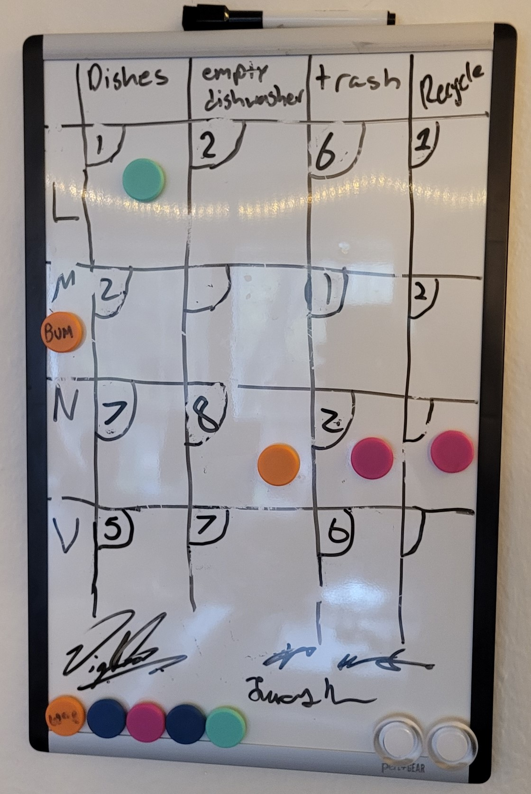
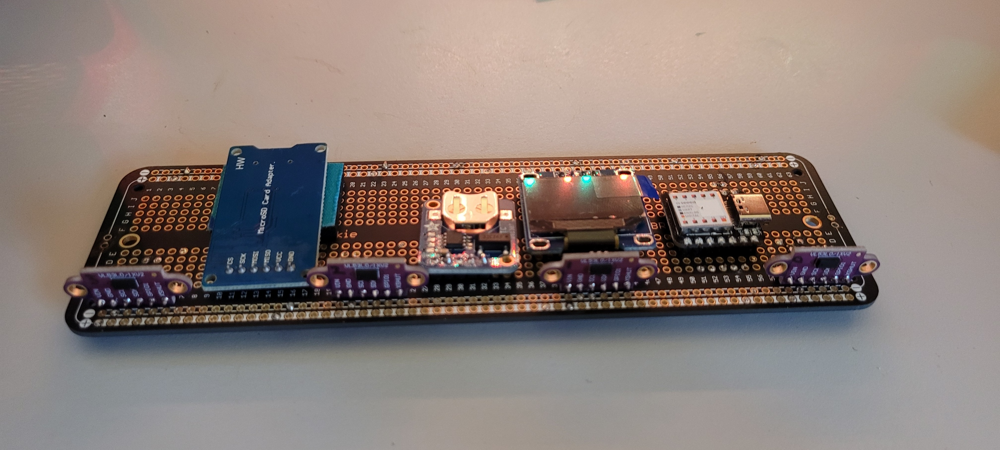
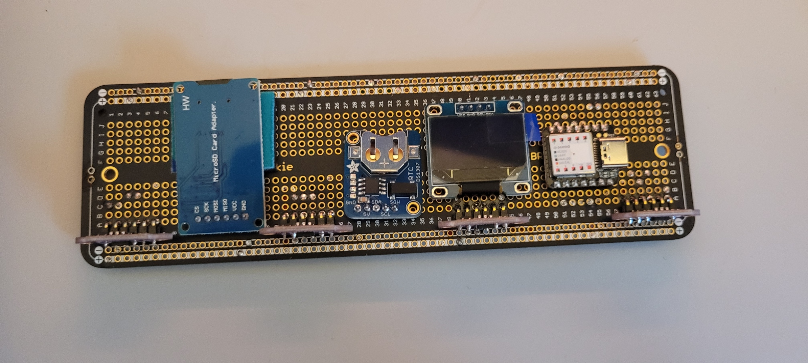
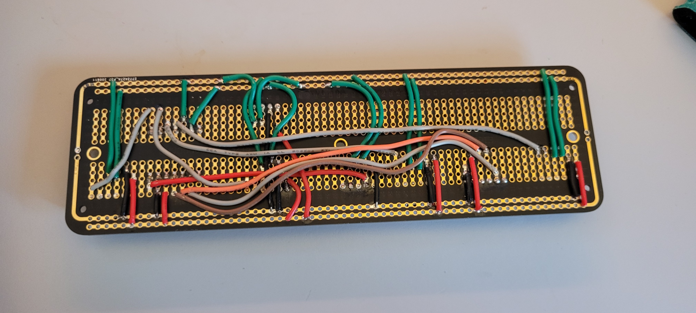

# choreChartTracker

Our apartment houses 4 undergrads, and in order to fairly and unambiguously delegate various chores we created a chore chart. Then, after about a year, with (some) time on our hands, we decided to be extra and build a chore chart tracker.

## The Chore Chart

    

Each row represents each room-mate, and each column represents a particular chore. When a room-mate is done with a chore, he moves the chore-token down one space. If a room-mate decides to do a chore when not his turn, he leaves the chore-token where it is, and he gets a tally which can be redeemed to skip his turn in the future. The table is drawn on a white board, and the chore-tokens are simple magnets. The system ensures zero ambiguity, ensures accountability, and distributes tasks fairly. The result: a very peaceful apartment.

## The nerdy tracker part

We've been using the chore chart for almost a year now and its been pretty fool-proof. Recently however we noticed synchronization events occurring - when all the chores lined up and cascaded through the chore chart simultaneously. While this is a giant pain for any scheduled chore-doer, it signalled that there might be interesting and somewhat abstract trends that might be worth exploring over time.

The first goal was to create a reliable way to track and log the movement of each of the chore-tokens. To do this we used [cheap VL53L0X time of flight sensors](https://www.amazon.com/gp/product/B07XXTMRR2/ref=ppx_yo_dt_b_search_asin_title?ie=UTF8&psc=1), [a micro-sd card reader](https://www.amazon.com/gp/product/B07BJ2P6X6/ref=ppx_yo_dt_b_asin_title_o03_s01?ie=UTF8&psc=1), [a DS1307 Real Time Clock](https://www.adafruit.com/product/3296), [a tiny OLED screen for messages](https://www.amazon.com/UCTRONICS-SSD1306-Self-Luminous-Display-Raspberry/dp/B072Q2X2LL/ref=sr_1_3?crid=ZQUYOGMSUCUY&dchild=1&keywords=0.96+oled&qid=1618080699&sprefix=0.96%2Caps%2C146&sr=8-3), [a nifty little microcontroller](https://www.amazon.com/Seeeduino-Smallest-Microcontroller-Interfaces-Compatible/dp/B08745JBRP/ref=sr_1_2?dchild=1&keywords=xiao&qid=1618080731&sr=8-2) to weave it all together, and [a nice large solderable breadboard](https://www.amazon.com/gp/product/B082KY5Y5Z/ref=ppx_yo_dt_b_asin_title_o03_s01?ie=UTF8&psc=1) to provide a semi-permanent base for everything. Below is an image of our build.

Our chore chart has 4 columns for each chore - the position of the chore-tokens within each of these columns are tracked by measuring their distances to the board via our time of flight sensors (these are mindblowingly amazing little devices) Because each cell in our table (where a chore-token would go) is predetermined and fixed, we can use the distance data from each time of flight sensor to know which room-mates row each chore-token is currently in. This data is queried and logged once a day into a micro sd card in a simple csv format, along with the current time and date as provided by our real time clock (RTC). The RTC has a backup coin-cell battery that allows the RTC IC to keep time even if the main board looses power (e.g. if we unplugged it for whatever reason). This allows for a convenient way to set and forget the time during initial programming of the board. The OLED allows for an easy and flexible way to display whatever we want, like time, date, derived information from logged data, memes, whatever.

All source code is [available under the "software" subdirectory](./software). The schematic, bill of materials, and other hardware details [are available in the "hardware" subdirectory](./hardware).

## What we do with the data

Haven't reached this part yet. Need to collect more data. Lots of potential things we could do. 

## Potential Improvements

1. A [wifi module](https://www.adafruit.com/product/4201) in the future to allow for remote access of logged data (maybe even a make lightweight server). This would allow for a lot of extra cool stuff.

2. Port over all the hardware into an actual PCB, with extendable daughter cards to allow for adding even more columns if needed. Would only really do this if for whatever reason demand appears for it. For now the solderable breadboard is perfect - its permanentness is adequate whilst still allowing for additions or modifications when/where needed.

## Peeps

- Mihir Savadi      : made the board. wrapped the low level stuff together.
- Lucas Nunn        : software stuff, data processing etc.
- Vignesh Sinha     : also software stuff.
- Nathan Strominger : moral support, creator of bomb-ass food, all around lad.
