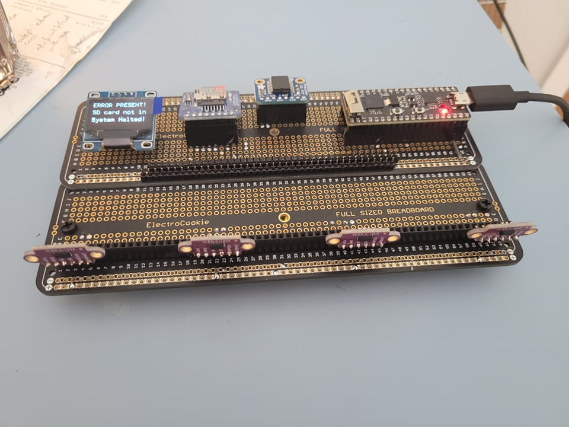
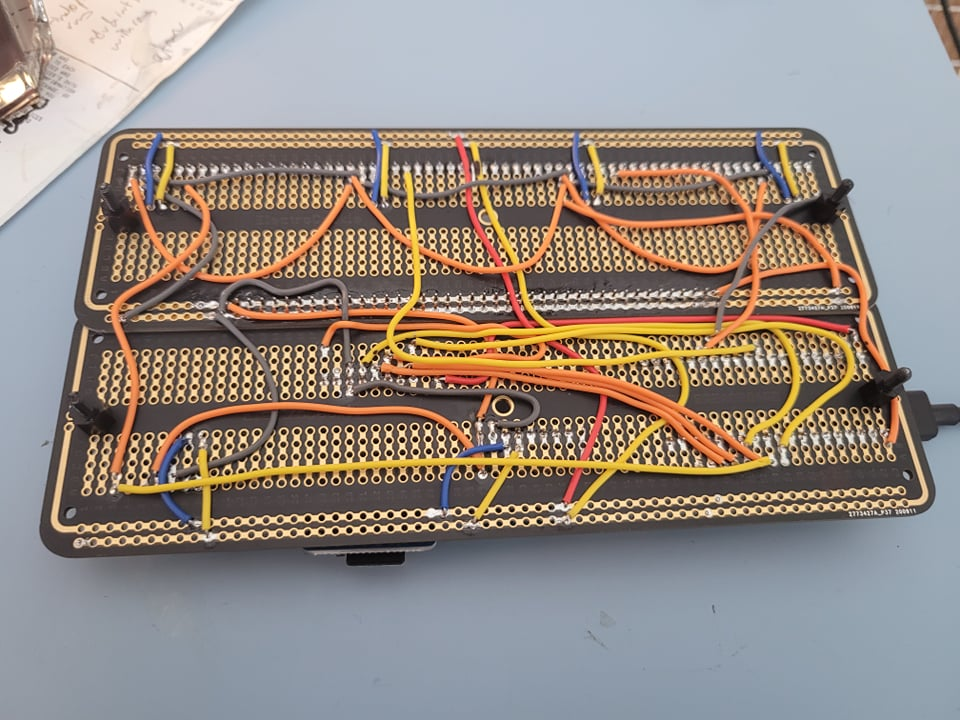

# choreChartTracker

Our apartment houses 4 undergrads, and in order to fairly and unambiguously delegate various chores we created a chore chart. Then, after about a year, with (some) time on our hands, we decided to be extra and build a chore chart tracker.

## The Chore Chart

    

Each row represents each room-mate, and each column represents a particular chore. When a room-mate is done with a chore, he moves the chore-token down one space. If a room-mate decides to do a chore when not his turn, he leaves the chore-token where it is, and he gets a tally which can be redeemed to skip his turn in the future. The table is drawn on a white board, and the chore-tokens are simple magnets. The system ensures zero ambiguity, ensures accountability, and distributes tasks fairly. The result: a very peaceful apartment.

## The tracker part

We've been using the chore chart for almost a year now and its been pretty fool-proof. Recently however we noticed synchronization events occurring - when all the chores lined up and cascaded through the chore chart simultaneously. While this is a giant pain for any scheduled chore-doer, it signalled that there might be interesting and somewhat abstract trends that might be worth exploring over time.

The first goal was to create a reliable way to track and log the movement of each of the chore-tokens. To do this we used [cheap VL53L0X time of flight sensors](https://www.amazon.com/gp/product/B07XXTMRR2/ref=ppx_yo_dt_b_search_asin_title?ie=UTF8&psc=1), [a micro-sd card reader](https://www.amazon.com/gp/product/B07BJ2P6X6/ref=ppx_yo_dt_b_asin_title_o03_s01?ie=UTF8&psc=1), [a DS1307 Real Time Clock](https://www.adafruit.com/product/3296), [a tiny OLED screen for messages](https://www.amazon.com/UCTRONICS-SSD1306-Self-Luminous-Display-Raspberry/dp/B072Q2X2LL/ref=sr_1_3?crid=ZQUYOGMSUCUY&dchild=1&keywords=0.96+oled&qid=1618080699&sprefix=0.96%2Caps%2C146&sr=8-3), [a nifty little microcontroller](https://www.amazon.com/Seeeduino-Smallest-Microcontroller-Interfaces-Compatible/dp/B08745JBRP/ref=sr_1_2?dchild=1&keywords=xiao&qid=1618080731&sr=8-2) to weave it all together, and [a nice large solderable breadboard](https://www.amazon.com/gp/product/B082KY5Y5Z/ref=ppx_yo_dt_b_asin_title_o03_s01?ie=UTF8&psc=1) to provide a semi-permanent base for everything. Below is an image of our build.

_^^^ most recent rev4 hardware_

Our specific chore chart has 4 columns for each chore - the position of the chore-tokens within each of these columns are tracked by measuring their distances to the board via our time of flight sensors (these are mindblowingly amazing little devices). Because each cell in our table (where a chore-token would go) is predetermined and fixed, we can use the distance data from each time of flight sensor to know which room-mate's row each chore-token is currently in. This data is queried and logged once a day into a micro sd card in a simple csv text file, along with the current time and date as provided by our real time clock (RTC). The RTC has a backup coin-cell battery that allows the RTC IC to keep time even if the main board looses power (e.g. if we unplugged it for whatever reason). This allows for a convenient way to set and forget the time during initial programming of the board. The OLED allows for an easy and flexible way to display whatever we want, like time, date, derived information from logged data, memes, whatever.

Chore charts can be row-expanded within the Time-of-Flight sensor's sensing distance limits; and column-expanded by adding more ToF sensors. The top-level libraries (see ./software/PICKVERSIONDIRECTORY/src) encapsulate all the logic into an easy to use API - so far confirmed with between 1 and 16 sensors (therefore 1 to 16 columns).

All source code is [available under the "software" subdirectory](./software). The schematic, bill of materials, and other hardware details [are available in the "hardware" subdirectory](./hardware).

## What we do with the data

Haven't reached this part yet. Need to collect more data. Lots of potential insights to find out.

## Peeps

- Mihir Savadi      : made the board. wrapped the low level stuff together.
- Lucas Nunn        : software stuff, data processing etc.
- Vignesh Sinha     : also software stuff.
- Nathan Strominger : moral support, creator of bomb-ass food, all around lad.

## TODOS and Notes

### Software Notes

TODOS:  

- Integrate ESP32 WiFi and google sheets back-up functionality.

Old Notes:
- For some reason the platformIO IDE makes it a pain to get its project linker to look at files in anything besides the /src and the natively handled libraries in /.pio/libdeps. This is why the /src directory here has all the source files that we wrote bundled directly together with main.cpp - not clean, but not a big deal either since there isnt a lot of stuff  

### Hardware Notes  

Old Notes:

- 5th July:
  Ditched custom PCB's all together. Was having very weird signal integrity issues on the i2c lines, which ended up being due to too much capacitance. Diagnosed with probing the circuit with an oscilloscope and logic analyzer - see [./pics_vids](./pics_vids) for images of what the signals looked like (sharkfinny and horrible). Never had this issue before on more complex boards, and did not have the time or energy for this project to find the peculiar root cause for this issue. My solution was to just go back to using a solderable breadboard, which I refer to as the rev4 hardware implementation. It's wiring is identical to that of the rev3 implementation, the schematic for which can be found in [./hardware/choreChartTracker_hardware_rev3](./hardware/choreChartTracker_hardware_rev3).

- 29th June:
  [Hardware rev2] The usb-c port placed so far back is too low for connector clearance. Connecting a usb cable causes the connecter to have   to lift up at an angle because of the vertical thickness of the connector, tearing the pins. It has to be placed closer to the edge for clearance. 

- 19th April:  
  Currently using the Seeeduino XIAO as the microcontroller on the solderable breadboard. Its running into lots of issues with the bootloader and dissapearing from the COM ports. Just around the time of integrating RTC code and testing on the OLED (18Apr'21) the XIAO decided to brick its bootloader again. After miraculously fixing it with several trial and error resets into DFU mode previously, repair doesnt seem like a completely deterministic process. Apparently this is a [known issue](https://forum.seeedstudio.com/t/odyssey-x86j4105-ubuntu-20-4-no-dev-ttyacm0-and-no-seeeduino-listed-under-lsusb/254322/19) which can be fixed, but it is a greater pain than it is worth. At this point most features have been integrated fairly smoothly, with this pain-of-a-uC being the bottle neck.

  Also with the solderable breadboard one of the power rails on the edges was decoupled from the power rails on the upper side and used as the I2C bus, which means the entire signal line was exposed and uninsulated. This is not a big deal because of the systems indoor nature, but when handling it with my hands and accidentally touching the I2C bus lines it was cool to see the OLED glitch out yet still maintain functionality somewhat. Should probably make a PCB.   
